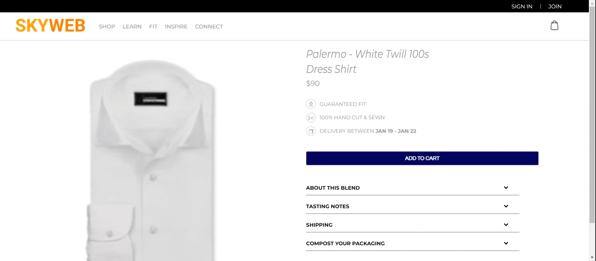

# Skyweb shop

# Getting Started

To start this project, please run the following commands:

### `npm install`

This command installs a package and any packages that it depends on.

### `npm start`

Runs the app in the development mode.\
Open [http://localhost:3000](http://localhost:3000) to view it in the browser.

The page will reload if you make edits.\
You will also see any lint errors in the console.
